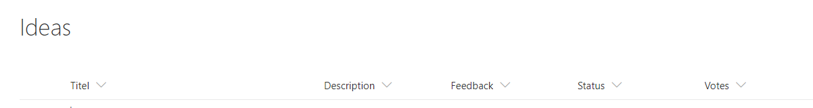
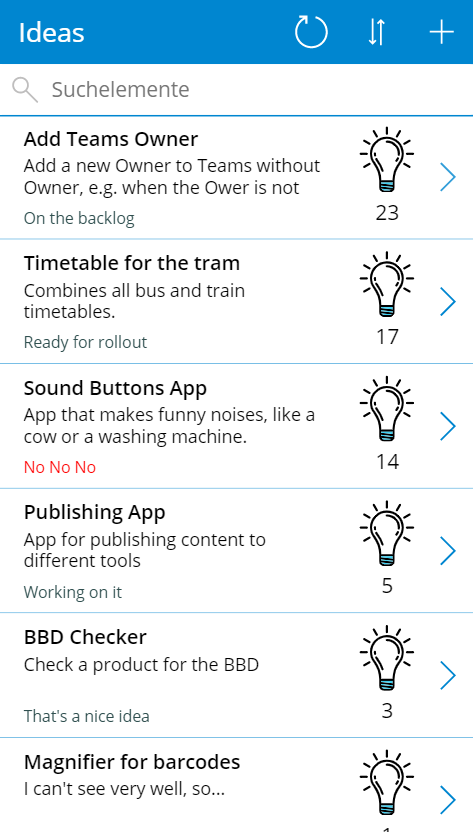
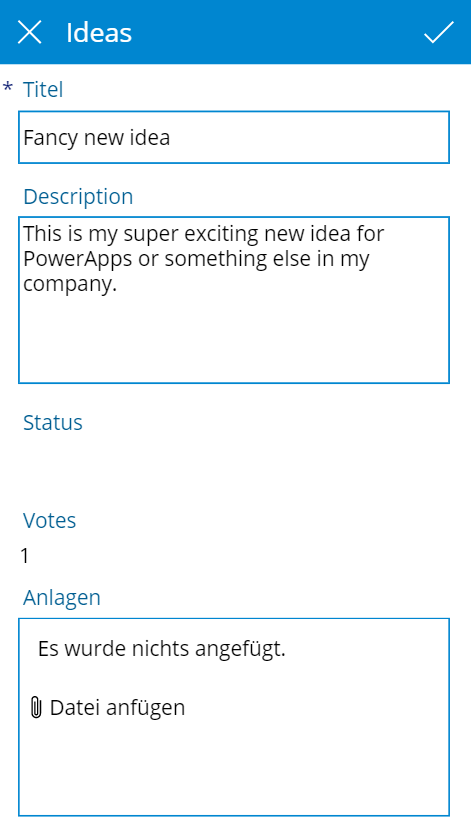
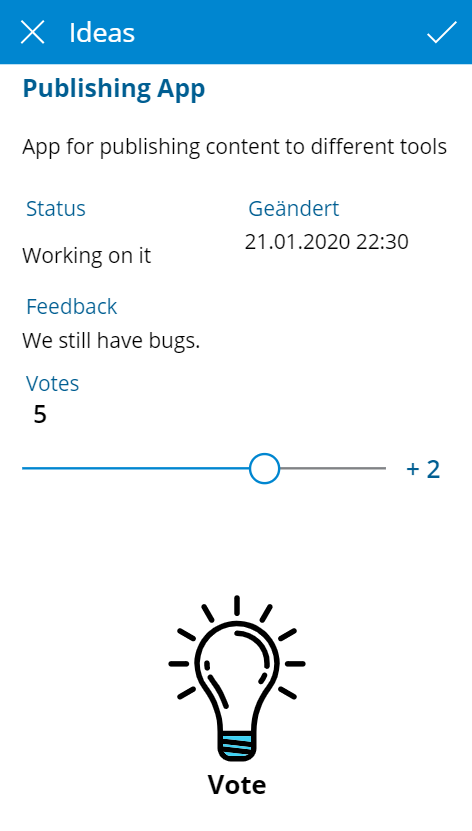

# Ideas PowerApps App

With this app, ideas can be introduced and voted on.

Used connectors: 
- SharePoint

What else you will need: 
- SharePoint list
- Good Ideas
---------
## Import 

### 1. Create SharePoint List
You need a SharePoint list with the following columns:
- Title - Type: Single line of text
- Description - Type: Multiple lines of text
- Feedback - Type: Multiple lines of text
- Status - Type: Choice 
    - e.g. New, That's a nice idea, Working on it, No No No
- Votes - Type: Number

[PnP Template](ideaslisttemplate.pnp)

### 2. Import App
After importing the app, you will have to make adjustments in the following places:

- Connectors: Connect your Table from the first Step.Make sure to name the fields of the table the same way, otherwise you may have to make further adjustments.

----------
## Demo

You can sort the Ideas by Votes (Descending and Ascending). 
`SortByColumns(Filter([@Ideas]; StartsWith(Title; TextSearchBox1.Text)); "Votes"; If(SortDescending1; Ascending; Descending))`

Alternatively, you can customize the code to sort by creation date or title, for example. Just change the word Votes.

### Add a new Idea

### Vote for an Idea
You can give an idea up to three plus points. First define the plus points using the slider. Then you can vote via the idea light bulb. 

-------------
I'm sorry for some german words in my screencaptures. 